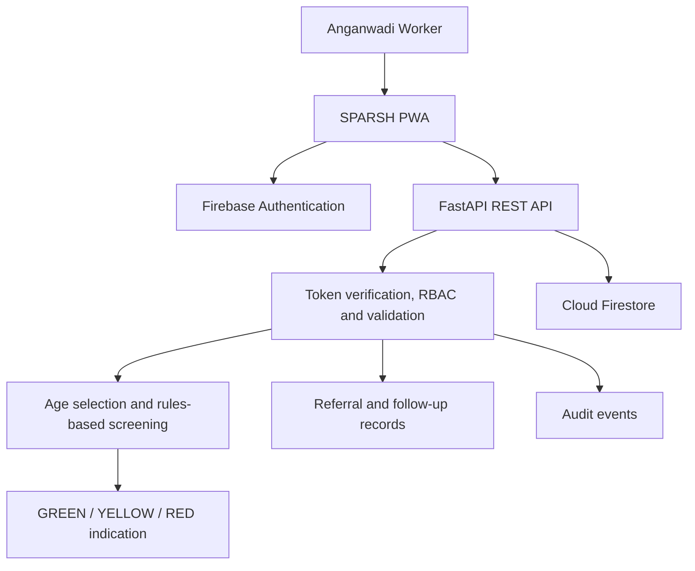

# SPARSH

**Developmental Screening & Follow-up Support Platform for Anganwadi Workers**

SPARSH is an AWW-focused software platform for recording child information, conducting age-based developmental screening, viewing rule-based risk indications, and documenting referrals and screening history.

> **Screening support only. SPARSH does not diagnose developmental disorders.** Its current milestone content and scoring rules are under evidence and professional review and have not been clinically validated.

## Project overview

The primary user is an Anganwadi Worker (AWW). SPARSH is built around a practical workflow: sign in, work within an assigned Anganwadi Centre, register a child, capture health information, complete a developmental screening, review the result, and document follow-up where appropriate. Supervisors can view operational records for assigned centres; administrators manage centres and provisioned accounts.

Requirements and field insights were gathered through interactions with parents, Anganwadi Workers, and pediatricians. This repository does not document a formal survey protocol or specialist survey results.

### Current capabilities

- Firebase sign-in with backend-verified identity and centre-scoped records.
- Centre and user administration for Admin accounts.
- Child registration and health measurements.
- Age-selected milestone questions with `YES`, `NO`, and `UNSURE` responses.
- Server-side, rules-based scoring with domain findings and `GREEN`, `YELLOW`, or `RED` indications.
- Screening history, result explanations, and referral records for `RED` results.
- A Progressive Web App shell and an IndexedDB-backed pending screening submission queue.
- English and Hindi UI translations.

## Architecture

The browser authenticates through Firebase Authentication and sends a Firebase ID token to the FastAPI service. The backend verifies the token and obtains application role and centre assignments from the Firestore user profile. Screening age selection, question-set validation, and scoring are performed by the backend.



### Technology

| Layer | Implemented technology |
|---|---|
| Frontend | React 19, Vite, Tailwind CSS, `vite-plugin-pwa`, Firebase JavaScript SDK, Recharts, i18next / react-i18next |
| Frontend API | Native `fetch` wrapper; requests use Firebase ID tokens |
| Backend | Python, FastAPI, Pydantic, Firebase Admin SDK |
| Data and identity | Cloud Firestore and Firebase Authentication |
| Screening | Python rule-based scoring and JSON milestone/rule configuration |

React Router, Axios, and a QR-code dependency are not present in the current package manifest. Frontend navigation is implemented in the application itself.

## Roles and access

The backend recognizes three roles. Authorization is enforced in API dependencies and centre assignments are checked on record access.

| Role | Implemented access |
|---|---|
| **Admin** | Create/update centres; provision, view, update, and activate/deactivate worker or supervisor accounts. Admin is not granted the worker-only operational write routes by their current role guards. |
| **Worker / AWW** | Register children, enter health measurements, submit screenings, and create referrals for eligible results. Read access is limited to assigned centres. |
| **Supervisor** | Read assigned-centre children, health history, milestones, screening results/history, and referrals; request the assistant endpoint (currently unavailable). No separate analytics or follow-up completion workflow is defined by the API role. |

Admins can access all centre records on endpoints whose role guards admit Admin; role-specific route restrictions still apply.

## Screening engine

The active production engine reads `backend/app/config/milestones.json` (currently `draft-1`) and `backend/app/config/scoring_rules.json`. It calculates the child’s completed age in months, selects the configured checkpoint at or below that age (using the youngest configured checkpoint for younger ages), and returns that checkpoint’s question set. The backend recomputes age and dataset version at submission and rejects stale checkpoint/version submissions. It requires each expected milestone ID exactly once.

`YES`, `NO`, and `UNSURE` answers feed deterministic weight and threshold rules. The result includes a domain-level score, configured findings, and one of `GREEN`, `YELLOW`, or `RED`. Referral creation is restricted to `RED` results and is protected against duplicate records. These labels and thresholds describe software rules only; they are not validated clinical categories or diagnostic conclusions.

## Developmental content and provenance

SPARSH models five domains: Gross Motor, Fine Motor, Language, Cognitive, and Social-Emotional. The repository contains an existing production milestone dataset as well as separate candidate datasets, an evidence ledger, a 65-item review set and review artifacts, coverage analysis, a safety review, and a checkpoint decision document. The candidate/review materials are not loaded by the production screening engine.

Content is moving through an evidence-review workflow. Source concepts are paraphrased and mapped with provenance; source checklists are not copied into the product. The 13 checkpoints × 5 domains (13 × 5) set is a project target, not a claim that existing sources provide equal coverage. Source age formats differ, and unresolved age/domain mappings remain subject to review. CDC listed ages, AAP surveillance ages, and WHO attainment windows are not interchangeable; an evidence source does not itself validate SPARSH wording, age selection, or scoring.

See [`docs/developmental-content-evidence-ledger.md`](docs/developmental-content-evidence-ledger.md), [`docs/final-65-review.md`](docs/final-65-review.md), [`docs/final-65-safety-review.md`](docs/final-65-safety-review.md), [`docs/final-65-coverage.md`](docs/final-65-coverage.md), and [`docs/final-65-checkpoint-decision.md`](docs/final-65-checkpoint-decision.md).

## AI assistant and machine learning status

An assistant API route and safety-related schemas/helpers exist, but `POST /api/v1/assistant/respond` currently returns HTTP 503 because no assistant provider is configured. There is no generated assistant response in the current implementation. A provider-backed, context-grounded AWW assistant is future work.

The intended direction is to ground an assistant in a child profile, screening history, current screening, approved developmental knowledge, and approved activity/follow-up guidance, then apply a scope and safety guard before presenting an AWW-friendly response. It must not diagnose, claim medical certainty, prescribe medication, invent child data or screening results, or override backend screening logic.

ML feature extraction and evaluation scaffolding are present, but screening uses `UnavailablePredictor`; no predictive model is configured or validated. Predictive ML is future work and requires an appropriately labelled dataset and validation before any use.

## Security and privacy

- Firebase ID tokens are verified by the backend with revoked-token checking; the Firestore `users/{uid}` profile supplies the authoritative role and centre assignments.
- API route guards enforce roles, and record operations check centre access. Centre creation/update and user administration are Admin-only.
- Pydantic request models validate payloads and selected models reject unknown fields. Screening submissions are checked against the current server-selected checkpoint and dataset version.
- Screening submissions use a client submission ID and a transactional uniqueness record to prevent duplicate writes. Referral records use deterministic IDs and duplicate protection.
- Audit events are written for key account, centre, child, screening, referral, and assistant actions. Audit write failures are logged; they do not fail the primary request.
- CORS origins are configured through backend settings. The checked-in example is for local development; set production origins in the deployment environment.
- Firebase service account JSON and `.env` files are excluded by `.gitignore`. Never commit credentials, tokens, or real environment values.
- The frontend queue stores pending screening answers in IndexedDB. Treat queued work as sensitive device data; do not assume it has reached or synchronized with the backend until submission succeeds.

## PWA and offline behavior

The Vite PWA plugin precaches the application shell and uses network-only behavior for `/api/` requests. Offline screening submission is supported through an IndexedDB queue with a unique client submission ID, duplicate detection, and up to five retry attempts with capped exponential backoff. A queued item remains pending when the server cannot be reached; a duplicate response is treated as already processed. The UI exposes synchronization status.

The cached shell can open without a network connection, but API data is not made available by API caching. Pending submissions are not server-confirmed records, and items that exhaust retry attempts remain queued for handling. Do not treat a local pending status as a completed screening or referral.

## API overview

All application routes are mounted beneath `/api/v1`; the health check is `/health`. These are the route groups and paths currently registered in `backend/app/routers`:

| Group | Implemented paths |
|---|---|
| User profile and administration | `GET /users/me`; Admin: `POST /users`, `GET /users`, `GET /users/{uid}`, `PATCH /users/{uid}`, `PATCH /users/{uid}/activation` |
| Centres | `GET /centres`, `GET /centres/{centre_id}`; Admin: `POST /centres`, `PATCH /centres/{centre_id}` |
| Children and health | `POST /children`, `GET /children`, `GET /children/{child_id}`, `GET /children/{child_id}/milestones`, `POST /children/{child_id}/health-data`, `GET /children/{child_id}/health-data` |
| Screenings | `GET /milestones?age_months=...`, `POST /screenings`, `GET /screenings/{screening_id}/risk`, `GET /children/{child_id}/history` |
| Referrals | `POST /referrals`, `GET /referrals/{referral_id}`, `GET /referrals/screening/{screening_id}` |
| Assistant | `POST /assistant/respond` (currently returns 503: provider not configured) |

For interactive request/response schemas, run the backend locally and open `/docs`.

## Repository structure

```text
SPARSH/
├── backend/
│   ├── app/
│   │   ├── ai/                 # Assistant request/safety groundwork
│   │   ├── config/             # Active rules and production/candidate content JSON
│   │   ├── core/               # Firebase, settings, auth/RBAC, audit
│   │   ├── ml/                 # Feature/evaluation scaffolding; unavailable predictor
│   │   ├── models/             # Pydantic domain and request/response models
│   │   ├── routers/            # FastAPI route groups
│   │   └── services/           # Milestone selection and scoring
│   ├── tests/                  # Backend pytest suite
│   ├── main.py
│   ├── requirements.txt
│   └── README.md
├── docs/                       # Evidence ledger and content review decisions
├── public/                     # Icons, logo, and static PWA assets
├── src/
│   ├── components/
│   ├── context/
│   ├── lib/                    # Firebase web initialization
│   ├── locales/                # English and Hindi translations
│   ├── screens/
│   └── services/               # API, auth, and offline queue
├── .env.example
├── package.json
├── vite.config.js
└── README.md
```

## Local development

### Prerequisites

- Node.js and npm
- Python 3.10 or newer (the project uses modern type syntax)
- A Firebase project with Firebase Authentication and Cloud Firestore enabled
- Firebase web app configuration for the frontend and a service account for the backend

### Frontend

From the repository root, copy `.env.example` to `.env` and fill in values for your own Firebase project and local API. Never commit `.env`.

```powershell
npm install
npm run dev
npm run build
```

### Backend

Copy `backend/.env.example` to `backend/.env`. Keep the Firebase service account JSON outside version control and point `FIREBASE_SERVICE_ACCOUNT_PATH` to it. From the repository root:

```powershell
cd backend
python -m venv .venv
.venv\Scripts\Activate.ps1
pip install -r requirements.txt
uvicorn main:app --reload --port 8000
```

The interactive API documentation is at `http://localhost:8000/docs`. To configure the first local Admin, follow the guarded, one-time bootstrap instructions in [`backend/README.md`](backend/README.md); there is no public Admin registration route.

## Configuration and deployment

The project deployment targets supplied for this repository are Vercel (frontend), Render (backend), and Firebase (Authentication and Firestore). No Vercel or Render deployment manifest is checked into this repository, so service settings and deployment-specific commands are managed outside the checked-in project configuration.

Set secrets in the relevant local environment files for development and in the hosting platform’s secret/environment settings for deployment. These are variable names only; do not put real values in documentation or Git.

**Frontend environment (`.env` at repository root):**

```dotenv
VITE_FIREBASE_API_KEY=
VITE_FIREBASE_AUTH_DOMAIN=
VITE_FIREBASE_PROJECT_ID=
VITE_FIREBASE_STORAGE_BUCKET=
VITE_FIREBASE_MESSAGING_SENDER_ID=
VITE_FIREBASE_APP_ID=
VITE_API_BASE_URL=
```

**Backend environment (`backend/.env`):**

```dotenv
FIREBASE_PROJECT_ID=
FIREBASE_SERVICE_ACCOUNT_PATH=
CORS_ORIGINS=
```

Never commit `.env` or Firebase service-account JSON. Configure deployment secrets through Vercel, Render, and Firebase as appropriate. The checked-in backend example defaults to localhost CORS and must be replaced with the actual frontend origin for a deployed service.

## Testing and checks

Backend tests use pytest and live in `backend/tests`. Run from the backend directory:

```powershell
cd backend
python -m pytest
python -m compileall app tests main.py
```

From the repository root, build the frontend and check the patch:

```powershell
npm run build
git diff --check
```

There is no frontend unit-test or end-to-end test script in `package.json`. Latest repository validation for this README update: `python -m pytest` — **148 passed** (1 dependency compatibility warning); `python -m compileall app tests main.py` — passed; `npm.cmd run build` — passed (Vite emitted a large-chunk advisory); `git diff --check` — passed.

## Clinical and Research Disclaimer

SPARSH is a software prototype/platform for developmental screening support. It does not provide a medical diagnosis. Developmental content and scoring require appropriate professional review and validation before clinical deployment. Public resources from CDC, WHO, IAP, or AAP do not imply that those organizations endorse SPARSH. Screening results should be interpreted appropriately, and concerning cases should be referred to qualified professionals.

## Roadmap

| Status | Work |
|---|---|
| **Implemented foundations** | Firebase authentication and RBAC; centre and user administration; child registration and health records; developmental screening, rules-based scoring, history, referrals; audit/security controls; PWA and offline queue foundations; evidence/content audit artifacts. |
| **In progress / under review** | Final developmental content review; hybrid age/checkpoint model; provider-backed AI assistant; approved activity and follow-up knowledge base; stronger longitudinal child profile. Candidate content is not the active production dataset. |
| **Future work** | Predictive ML only after a suitable labelled dataset and validation; stronger clinical and larger field validation; expanded multilingual coverage; production-scale deployment hardening. Analytics exist in the frontend, but further analytics work is not presented as an approved roadmap commitment. |

## Contributing

1. Fork the repository.
2. Create a focused feature branch.
3. Make a small, scoped change.
4. Run the backend tests and frontend build for relevant changes.
5. Check formatting and `git diff --check`.
6. Submit a pull request describing the change and its validation.

Please preserve these project rules:

- Never commit secrets, credentials, service-account JSON, or real environment values.
- Do not change developmental content without recording provenance and review status.
- Do not add unsupported medical or clinical claims.
- Preserve existing API contracts and role/centre access boundaries; add backend tests when backend behavior changes.

## License

License: Not yet specified. No license file is present in the repository.

## References and acknowledgements

These public materials are references used in the repository’s evidence-review work. Concepts are paraphrased and mapped with provenance; the source organizations do not endorse SPARSH.

- [CDC: Developmental Milestones](https://www.cdc.gov/act-early/milestones/index.html)
- [WHO: Care for Child Development](https://www.who.int/publications/i/item/9789241548403)
- [WHO: Motor Development Study—Windows of Achievement](https://www.who.int/docs/default-source/child-growth/child-growth-standards/indicators/motor-development-milestones/who-motor-development-study-windows-of-achievement-for-six-gross-motor-development-milestones.pdf)
- [IAP Neurodevelopmental Pediatrics Chapter: 2025 high-risk infant follow-up consensus guideline](https://www.indianpediatrics.net/aug2025/554.pdf) — used for high-risk follow-up context and tool selection, not as a general milestone item bank. See the [evidence ledger](docs/developmental-content-evidence-ledger.md); do not infer endorsement.
- [American Academy of Pediatrics (AAP): Motor Delays—Early Identification and Evaluation](https://publications.aap.org/pediatrics/article/131/6/e2016/31072/Motor-Delays-Early-Identification-and-Evaluation)
